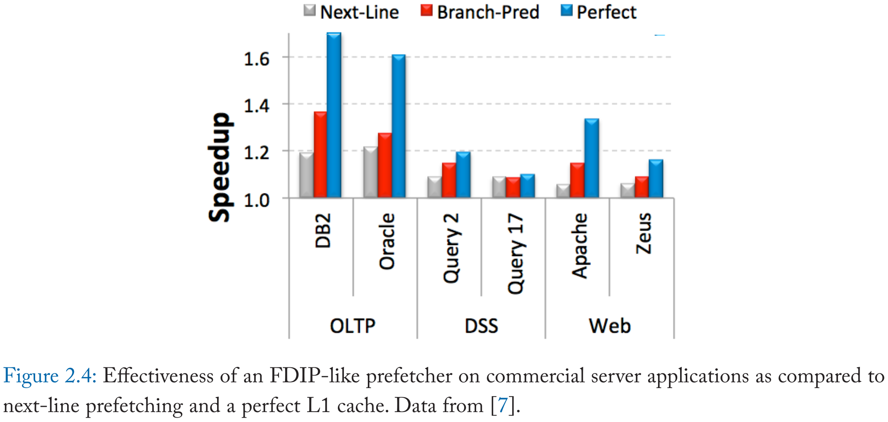
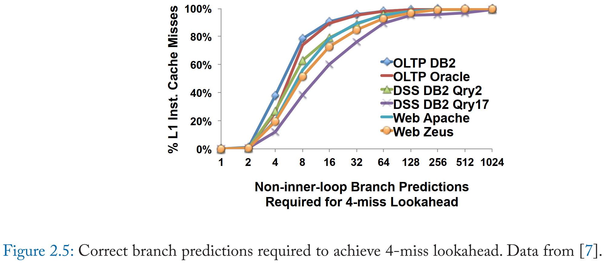
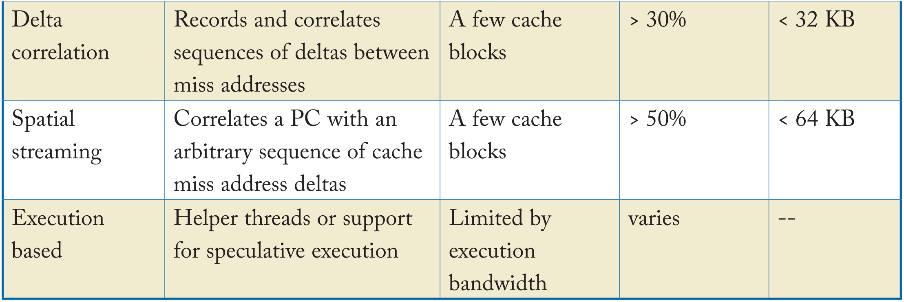

# A Primer on Hardware Prefetching 笔记

- [1 Introduction](#1)
- [2 Instruction Prefetching](#2)
- [3 Data Prefetching](#3)
- [4 Concluding Remarks](#4)

&nbsp;   

## 1 Introduction

### 1.1 The Memory Wall

### 1.2 Prefetching

#### 1.2.1 Predicting Addresses

#### 1.2.2 Prefetch Lookahead

#### 1.2.3 Placing Prefetched Values

&nbsp;   

## 2 Instruction Prefetching

### 2.1 Next-Line Prefetching

### 2.2 Fetch-Directed Prefetching

### 2.3 Discontinuity Prefetching

### 2.4 Prescient Fetch

### 2.5 Temporal Instruction Fetch Streaming

### 2.6 Return-Address Stack-Directed Instruction Prefetching

### 2.7 Proactive Instruction Fetch

&nbsp;   

## 3 Data Prefetching

### 3.1 Stride and Stream Prefetchers for Data

### 3.2 Address-Correlating Prefetchers

### 3.3 Spatially Correlated Prefetching

### 3.4 Execution-Based Prefetching

### 3.5 Prefetch Modulation and Control

### 3.6 Software Approaches

&nbsp;   

## 4 Concluding Remarks

