# [Spring 2015 -- Computer Architecture Lectures -- Carnegie Mellon](https://www.youtube.com/playlist?list=PL5PHm2jkkXmi5CxxI7b3JCL1TWybTDtKq) 笔记

> 我看的是这个版本：[Computer Architecture - ETH Zürich - Fall 2017](https://www.youtube.com/playlist?list=PL5Q2soXY2Zi9OhoVQBXYFIZywZXCPl4M_)   
> 课程主页：[Computer Architecture – Fall 2017 (263-2210-00L)](https://safari.ethz.ch/architecture/fall2017/doku.php)   
> 课件：[Schedule - Computer Architecture - Fall 2017](https://safari.ethz.ch/architecture/fall2017/doku.php?id=schedule)   
> 论文阅读：[Readings - Computer Architecture - Fall 2017](https://safari.ethz.ch/architecture/fall2017/doku.php?id=readings)   
> 15年的lab：[Labs](http://www.archive.ece.cmu.edu/~ece447/s15/doku.php?id=labs)   
> 15年的 schedule：[Schedule](http://www.archive.ece.cmu.edu/~ece447/s15/doku.php?id=schedule)

> 这门课中讲了大量的 trade-offs，很多我没有记录

- [Lecture 1: Introduction and Basics](#01)
- [Lecture 2: Fundamentals, Memory Hierarchy, Caches](#02)
- [Lecture 3: Cache Management and Memory Parallelism](#03)
- [Lecture 4: Main Memory and DRAM Fundamentals](#04)
- [Lecture 5: DRAM, Memory Control, Memory Latency](#05)
- [Lecture 6: Low-Latency DRAM and Processing In Memory](#06)
- [Lecture 7: Emerging Memory Technologies](#07)
- [Lecture 8: SIMD Processors and GPUs](#08)
- [Lecture 10: Branch Prediction](#10)
- [Lecture 11: Control-Flow Handling](#11)
- [Lecture 12: Memory Interference and QoS](#12)
- [Lecture 13: Memory Interference and QoS (II)](#13)
- [Lecture 15: Multi-Core Cache Management](#15)
- [Lecture 16: Heterogeneous Multi-Core](#16)
- [Lecture 17: Latency Tolerance and Prefetching](#17)
- [Lecture 18: Prefetching](#18)
- 

&nbsp;   

## Lecture 1: Introduction and Basics

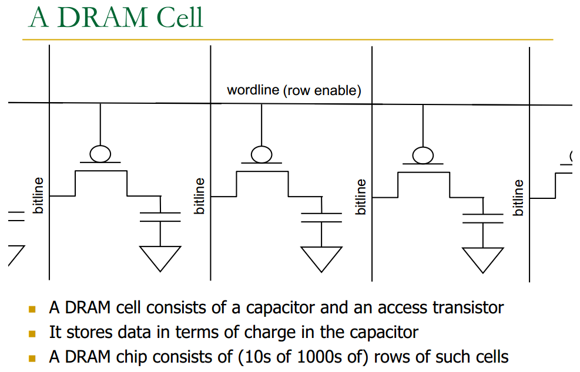

周期性地 refresh，refresh 时 DRAM 不可用

Memory Controller 向 DRAM 发送 refresh command

**DRAM Row Hammer**：在一个 refresh interval 中频繁 open（高电压）, close（低电压） 一个 row，会造成其他临近 row 的错误

&nbsp;   

## Lecture 2: Fundamentals, Memory Hierarchy, Caches

- Sequential Execution Model
  - control driven (instruction pointer)
- Data Flow Model （类似 DAG scheduler）
  - data driven
  - parallel execution：当输入操作数就绪时，指令就可以执行 (hard for hardware)
  - hard for debugging

- **ISA**: Specifies how the programmer sees instructions to be executed
  - software/compiler assumes, hardware promises
  - 比如 IA32 手册
- **Microarchitecture**: How the underlying implementation actually executes instructions
  - 只要满足 ISA 的语义，指令可以以任意顺序执行
  - 流水线，乱序执行，超标量，指令预取

### DRAM

- storage: capacitor
- access (transistor): wordline (row enable) + bitline

### SRAM

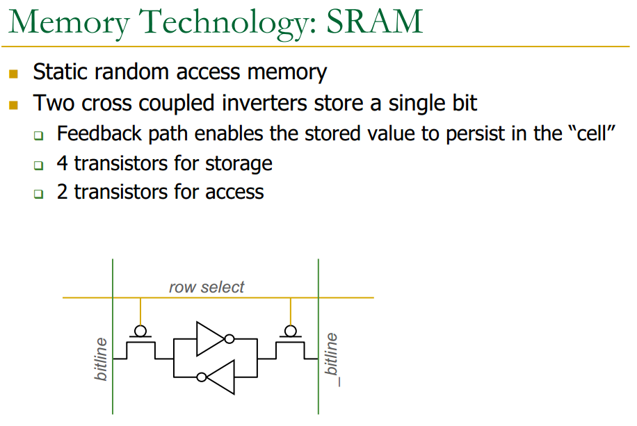

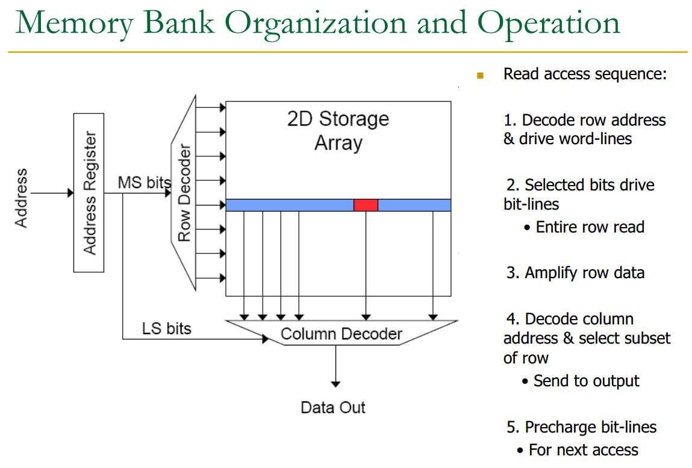

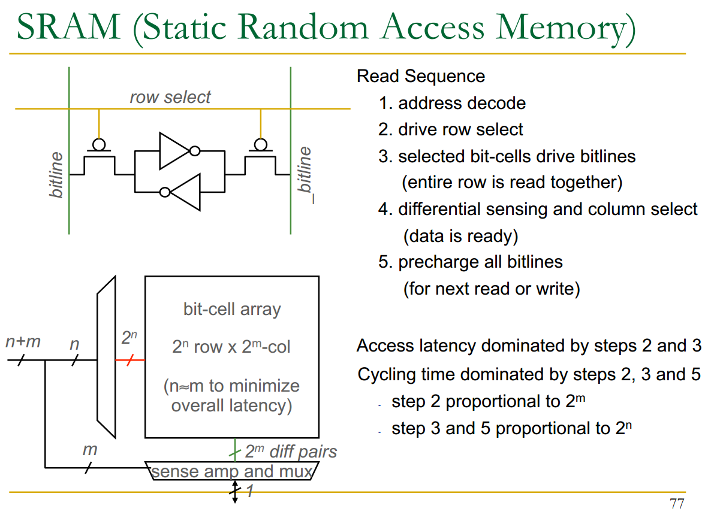

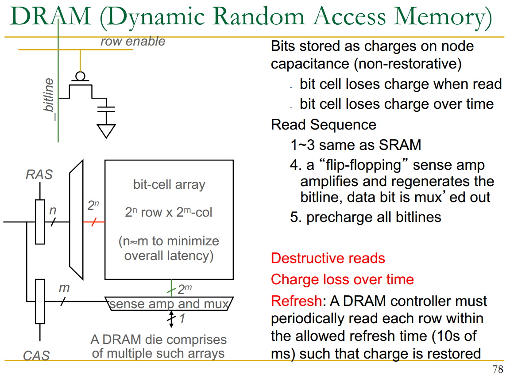

- 局部性原理
  - Temporal Locality
  - Spatial Locality

- Cache design decisions
  - Placement
  - Replacement
  - Granularity of management
  - Write policy
  - Instructions/data

&nbsp;   

## Lecture 3: Cache Management and Memory Parallelism

2^k 路组相连：cache 有 2^n line，分为 2^(n-k) 组，每组 2^k line。内存地址其中 (n-k) 位作为组号，组内 2^k line 使用 cache replacement policy   
k=0 时就是 directed map（直接映射）

### replacement policy

- LRU 的实现手法：对于 k路组相连，有 k! 种排序，于是需要 log2(k!) bits
  - 难以实现
- Next Victim：存储固定数量的 victim，作为循环队列，相当于判了缓刑，如果在 evict 前被 hit，那么清除出队列，后面的向前进，最后一个 victim 随机选一个
  - 硬件易于实现，通常有两个 victim 位置

**cache miss rate** 和 **execution time** 不同，因为有些 block is costly，以及 miss overlap

### Write policy

- **write through**：每次都回写内存（**consistency**）
- **write back**：evict 时回写内存

write miss：1. 直接写内存；2. 先 load 到 cache

### Instructions vs. Data

- Unified
  - + 共享 cache 空间
  - - I 和 D 在 pipeline 不同阶段（**因此 L1 cache 把指令和数据分开，因为 L1 cache 的设计核心就是 pipeline**）
  - - I 和 D 互相引起 thrash

### Multi-level Cache

- 一级 cache 内部
  - tag store & data store access：顺序 / 并行
- 不同 cache之间
  - Serial
  - Parrallel

### Cache 参数

- cache size
  - 超过一定值后性能不再显著提升
- block size
  - 太小无法利用 spatial locality，太大花费大量时间 fill 整个 block
- associativity（cache 一组有多少 line）
  - 大：命中率高，高 latency
  - 小：低 latency
- replacement policy

### Cache Miss 分类

- compulsory：首次访问某个 block 导致的 miss
  - prefetch
- capacity：被换出
  - associativity
  - software hints
- conflict：其他
  - 程序设计层面，data fits into cache

### 性能提升

> 2个术语：latency 是提供服务所花的时间；cost 是 stall processor 的时间

- reduce miss rate
  - victim cache：缓存最近被换出的 block。也就是额外维护一个缓存（所有组共享），防止 thrashing
  - hash
  - pseudo associativity：serial lookup
- reduce miss latency/cost
  - **low miss rate 不代表 low stall time**
  - Memory Level Parallelism：cache isolated miss 提高性能，见下图
- reduce hit latency/cost
- reconstruct data structure and access pattern
  - 数据访问对 cache 友好
  - 数据分片 fits into cache
  - AOS & SOA

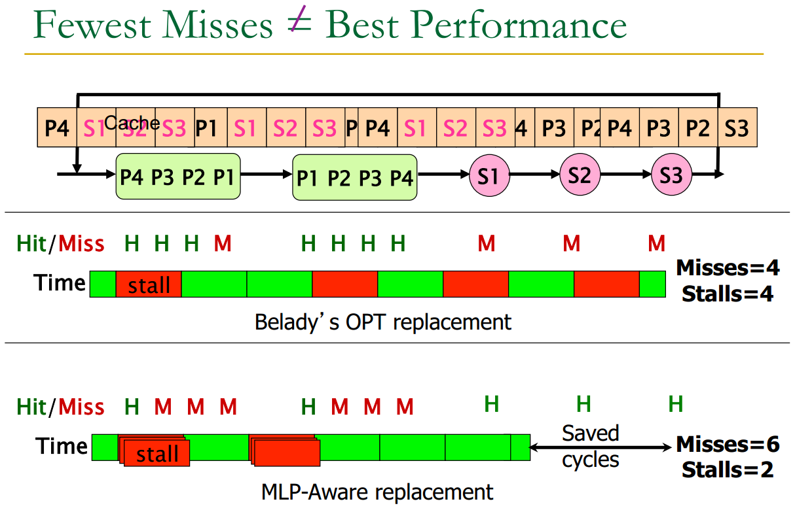

> P1-4 并行访问，S1-3 串行访问   
> cache S1-3 的 stall 较小

### 混合缓存替换算法

- 运行时切换 replacement policy
- 选择 policy：使用饱和计数器

> 有个问题：切换 policy 时的 reconstruct 怎么做？overhead 几何？

### cache 并发访问

Miss Status Handling Registers  记录 miss 的状态与数据

&nbsp;   

## Lecture 4: Main Memory and DRAM Fundamentals

### 提高 Cache 带宽

multi-access per cycle or consecutive cycle

#### Banking (Interleavig)

把 address 划分成不同的 banks，access latency 在多个 bank 上重叠

### Memory System

- bandwidth
- latency
- capacity
- energy

### Main Memory Fundamental

对 latency 的处理方法：分 bank。比如 4 个 bank，要访问 32b 数据，一个 bank 提供 8 bit，如果 latency 是 3 cycle，那就刚好不用阻塞。

Rank: Multiple chips operated together to form a wide interface

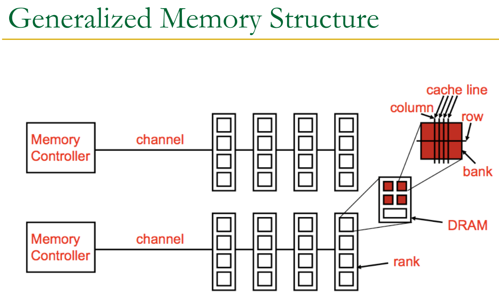

&nbsp;   

## Lecture 5: DRAM, Memory Control, Memory Latency

### Latency

- CPU -> Controller (transfer time)
- Controller latency
  - queuing & scheduling delay
  - access -> commands
- Controller -> DRAM (transfer time)
- DRAM bank latency
  - CAS (column address strobe) if row hit
  - RAS + CAS (row address strobe + column address strobe)
  - PRE + RAS + CAS
- DRAM -> Controller (transfer time)
  - bus latency
- Controller -> CPU (transfer time)

### Multiple Banks (Interleaving) and Channels

multi-bank：并发访问 DRAM   
multi-channel：增加带宽

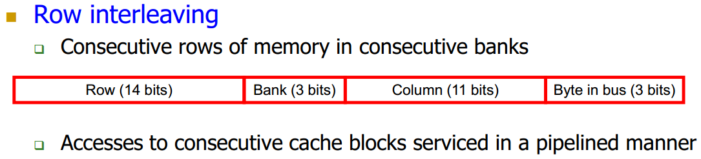

把 row bit 放到高位，因为内存地址通常是连续访问的，增大 row hit rate

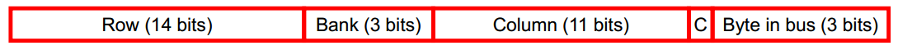

如果 hardware 向 OS 暴露 bank bit，那么 OS 可以把不同进程在物理空间上隔离

### DRAM refresh

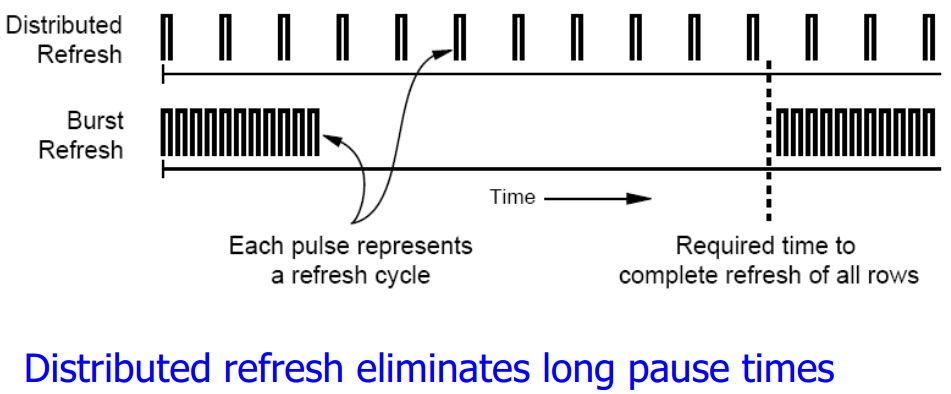

### DRAM Controller

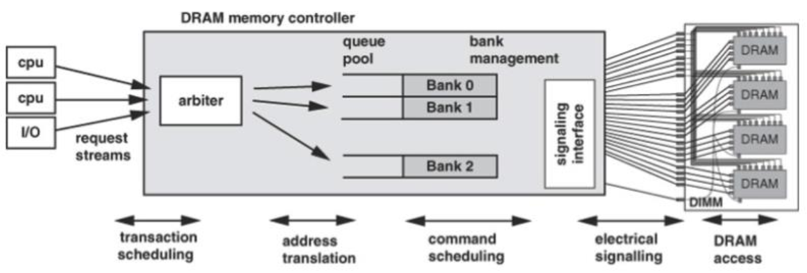

DRAM Controller 位于 CPU chip

#### 功能

- 保证在 DRAM 上的正确操作
- 资源冲突
- 调度

### 调度

调度就是基于优先级对请求排序：

- request 顺序
- row buffer hit
- request 类型（prefetch, read, write）
- request criticality
  - stall processor
  - dependency

### DRAM timing constraint

DRAM Controller 在 issue 两个指令之间有一个 latency，为了等待 DRAM 完成操作。这一等待是同步的，也就是说提前设置好的 latency，DRAM Controller 假定在这个时间后 DRAM 已经完成操作。如果 DRAM 提前完成，并不通知 Controller。

### Simulation

- 快速得出该决策在某种环境下的结果
- 模拟现有系统环境，得到准确估计结果
- Trade-Offs：速度，灵活，准确

### Memory Latency

2h15min 详细讲了 DRAM 的构成

- desgin for DRAM
  - 最大化 capacity，而非 latency
  - sense amplifier 的大小是 cell 的几百倍，少 sense amplifier 节省空间，但是增加 bitline 长度，增加了 latency
- timing constraints 按照最坏的情况设置

#### Tiered-Latency DRAM

trade-off：在 sense amplifier 上再做一层 cache

&nbsp;   

## Lecture 6: Low-Latency DRAM and Processing In Memory

### Latency

DRAM latency 通常设置为较大值，因为考虑到温度，设备，等原因的 worst case，因此在通常情况下会导致时间浪费

- temperature：温度高 latency 高
- DRAM cell：大小不一样，小的 latency 高
- latency variation：sense amplifier 和 row 的距离

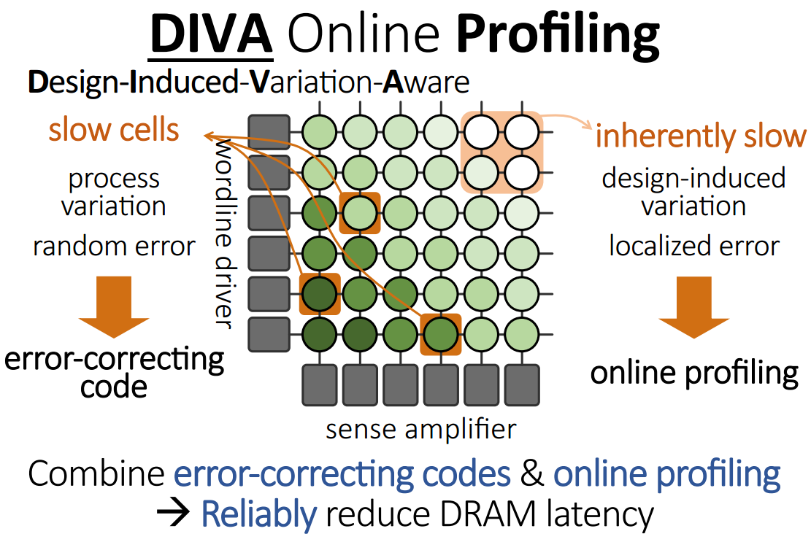

### Process in Memory

computation 和 storage 距离太远

- **move data overhead - bitline**
- **bulk data movement - hardware level**
- bitwise operation
- Graph Process

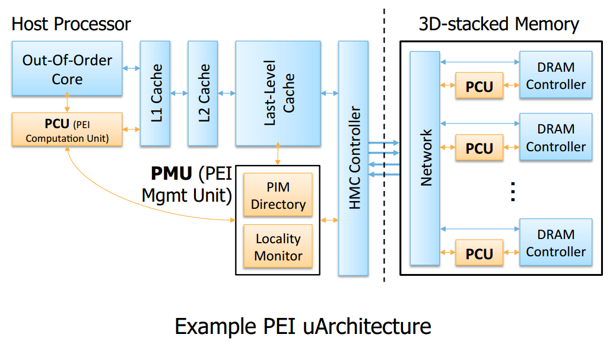

locality monitor 决定在 cache 还是 memory 中执行

假设 cache 非常差以致于可以忽略，那么所有操作都*应该*在 memory module 执行

&nbsp;   

## Lecture 7: Emerging Memory Technologies

resistive memory：non volatile, phase change memory

hybrid memory - DRAM + PCM

&nbsp;   

## Lecture 8: SIMD Processors and GPUs

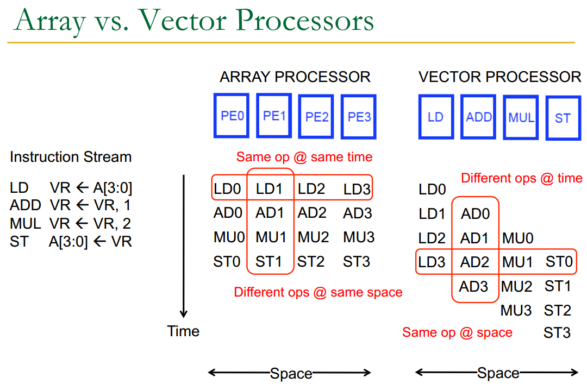

- Array Processor：指令在 **不同位置** **同时** 执行
- Vector Processor：指令在 **相同位置** **连续时间** 执行
  - （我觉得这有点问题，有些指令周期不一样，还得有同步措施）

### Vector Processor

basic address + stride length

- 设计数据结构与硬件相匹配
- stride length 和 bank number 影响性能

scatter, gather, conditional select：将 control flow dependency 转换为 data dependency

&nbsp;   

## Lecture 10: Branch Prediction

目标：**为了让 pipeline 保持 full，要尽快知道 next fetch instruction address**

### Control Dependence Handling

在 pipeline 模型中，fetch stage 需要知道下一个 PC address，面临的问题有

- 当前指令是否是分支
  - 如果 BTB 返回一个 target address，那么一定是分支
  - 或者在 instruction cache 中判断
- （如果是分支）选择哪一个
  - 静态/动态 分支预测
- 跳转地址（如果需要跳转）
  - BTB: branch target buffer

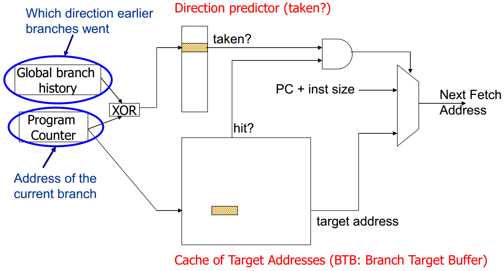

### 静态分支预测

- 固定预测
- Backward taken, forward not taken
  - 循环语句一般 target 在 loop 判断之前，所以让假定跳转
- Profile based
  - 提前分析，并给出 hint
- Program analysis based
  - `#define likely(x) __builtin_expect(!!(x), 1)`

### 动态分支预测

#### Last-Time Predictor (One-Bit Counter)

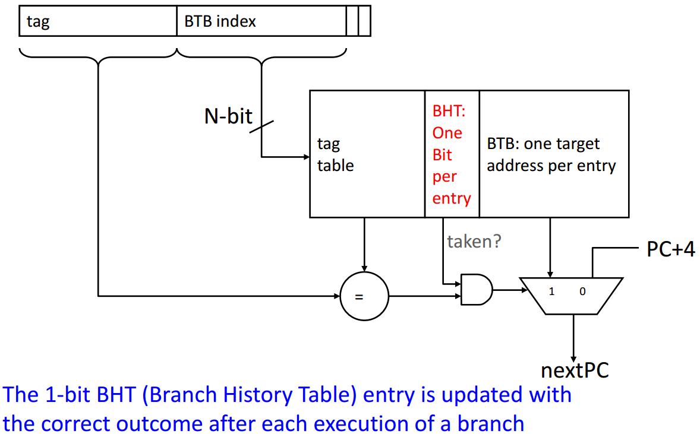

#### Two-Bit Counter Prediction - 饱和计数器

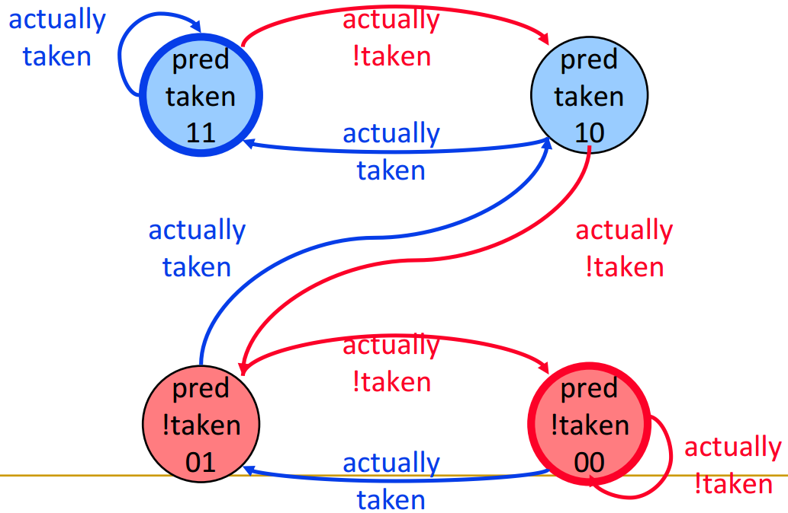

#### Two-Level Prediction

- 不同的分支之间有影响
- 同一个分支的一系列历史

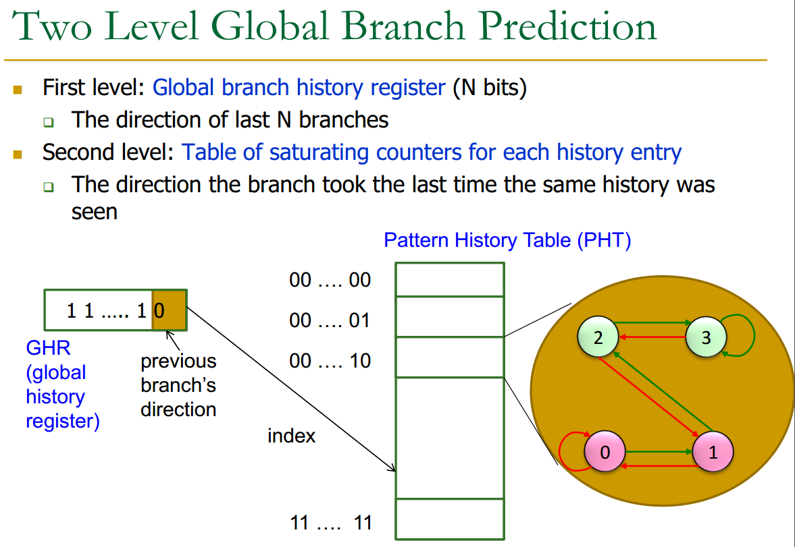

GHR 是全局 branch 历史，指向 pattern table（共 2^n） 的一项，每一项都是饱和计数器

&nbsp;   

## Lecture 11: Control-Flow Handling

### Trace Cache

注意到一个事实：程序总是频繁地执行一个 trace（一系列指令，可能不连续）

因此，我们把这些 **动态指令序列** 缓存起来，一次 fetch

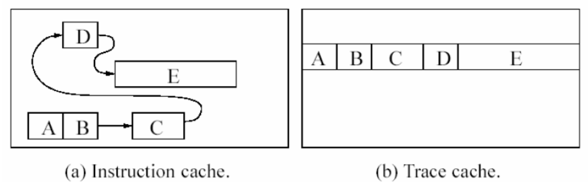

- 降低了 fetch 间隔
- 不需要 decode（已经 decode）
- trace 视为一个整体操作（没有分支），可以内部优化
- fill unit 生成 trace
- 如何 index trace cache
- trace 冗余（例如 ABC，ABD）
- 需要多个分支预测

### Predicated Execution

将 control dependency 转变成 data dependency（例如：CMOV, SETG）   
将 选择哪个branch 转变成 等待data完成计算

useless work

如果 branch hard to predict，可以 Predicated Execution；否则使用 branch prediction

### Prediction Latency

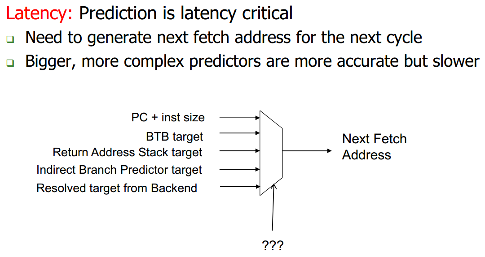

&nbsp;   

## Lecture 12: Memory Interference and QoS

资源：functional units, pipeline, cache, bus, memory

资源会在 multi-core 和 multi-thread 共享，multi-thread 可以共享 L1 cache，register 和 pipeline。这里主要讨论 multi-core 共享 memory，memory controller，bus 和 shared cache

### Memory Scheduling

- DRAM Controller 如何调度 request
- request latency
- 考虑到 banks，row hit

#### Parallelism-Aware Scheduler

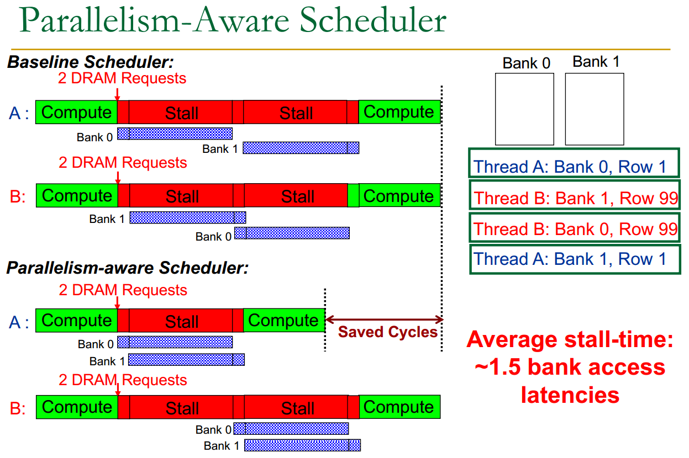

- 对一个 core 的 request，在不同 bank 上 parallel access
- 会导致 starvation
  - 解决方案是把 request 按 batch 执行，每个 batch 内 parallel access

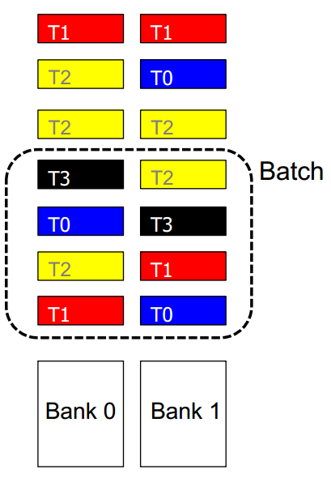

#### Batch 内部调度

- FIFO
- row hit
- 指定 core 优先级（shortest stall-time first）

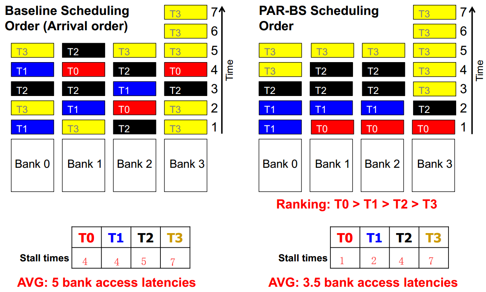

### Thread Cluster Memory Scheduling

**混合 fairness 和 throughput** 方法，分为两个 cluster

- **throughput**: memory-non-intensive threads
- **fairness**: memory-intensive
  - rank shuffle：由于对 interference 的影响不同
  - row buffer locality 导致 interference
  - bank-level parallelism 受 interference 影响

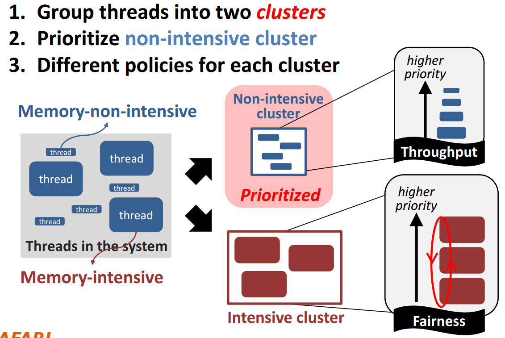

### Blacklisting Memory Scheduler

- rank 开销大，取代的做法是 **group**
- consecutive requests 导致 interference，加入 blacklist
- 定期清空 blacklist

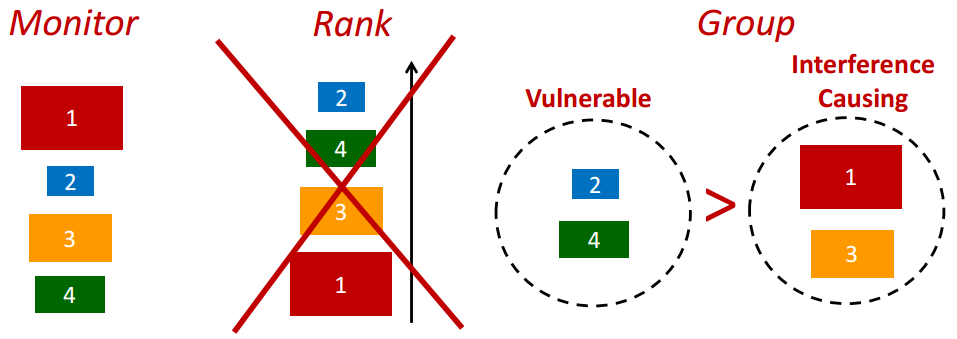

&nbsp;   

## Lecture 13: Memory Interference and QoS (II)

QoS 太细节了，主要是我并不知道底层硬件可以提供什么，需要暴露一些细节和软件配合来达优化。很多方案看起来说的很好，也就只能听听了。。。换句话说我不能 reason about low level hardware

### Decoupled Direct Memory Access

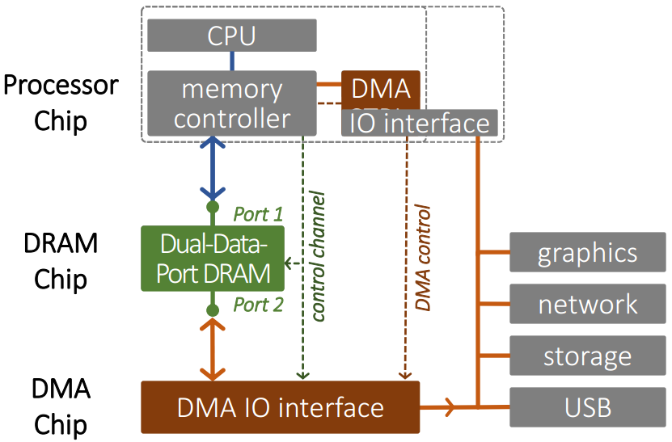

&nbsp;   

## Lecture 15: Multi-Core Cache Management

### Multi-Core Caching Issues

- cache efficiency
- shared data between core
- connect cache
  - Non-uniform cache access
  - cache interconnect

### Controlled Shared Caching

#### Hardware-Based Cache Partitioning

- way-based
- block-based
- dynamic fairness (on miss rate slowdown)

#### Software-Based Cache Partitioning

- page coloring

### Private/Shared Caching

- private cahce，但可以共享给别的 core
- spill / receive

### Non-Uniform Cache Access

### Efficient Cache Utilization

- placement
  - read/write miss?
- replacement (insertion)
  - 考虑到 streaming access
  - block **reuse prediction**
- schedule

### Cache Compression

> 维护起来太复杂，记得 leveldb 里面 SSTable format，简直了。。

&nbsp;   

## Lecture 16: Heterogeneous Multi-Core

Heterogeneous + trade-off

&nbsp;   

## Lecture 17: Latency Tolerance and Prefetching

### Memory Latency Tolerance

out-of-order instruction execution：有一个 instruction window，可以按照 data flow dependency 来乱序执行，但是 instruction 必须按顺序 retire (可以理解为 commit)

- caching
- prefetching
- multi-threading
- out-of-order execution

### Runahead Execution

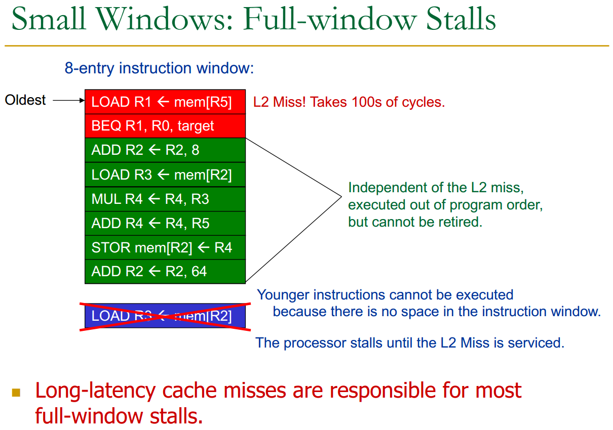

有一个 long cycle instruction 把整个 window stall 了。

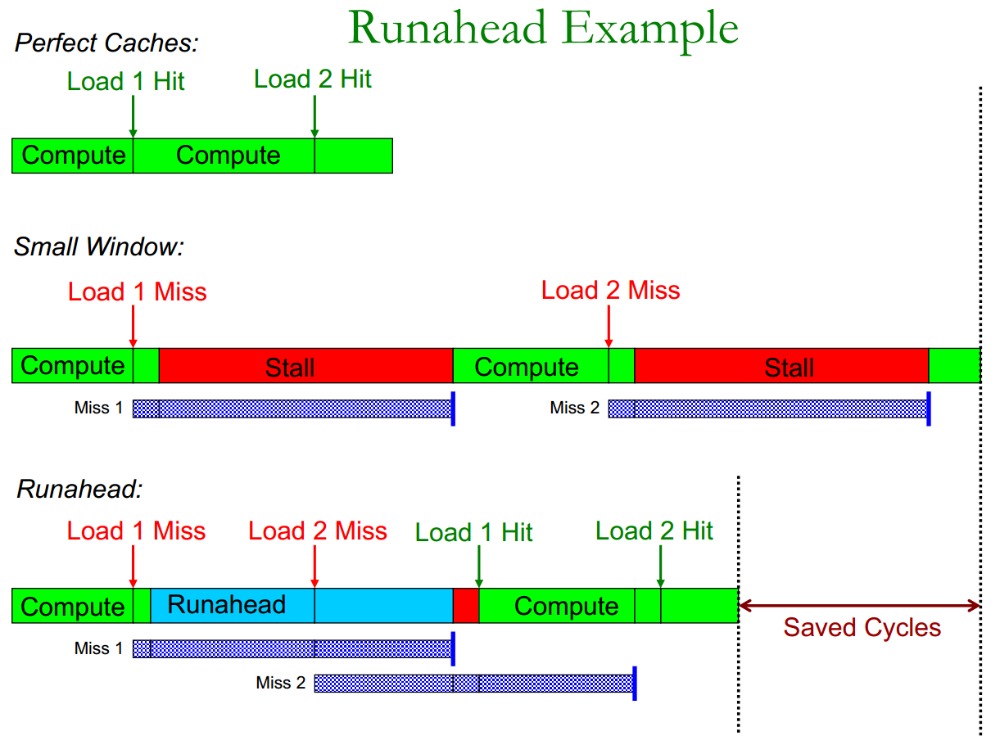

- 执行 load，并且存储当前状态，继续向前执行，遇到 long cycle load 就执行，并跳过
  - 不 update architecture state，不 update memory（太难了）
- 直到 fetch 结束，回退到之前的状态（第三行的红色表示回退的 penalty）
- 重新开始执行（这样之后的若干个 fetch miss 已经 hit）

> 那我想说，run-ahead 还执行那些运算指令干啥，就只执行 memory access instruction 就好了，反正运算指令还是会重新执行一遍的。   
> 也许某些内存地址是需要计算的。。。   
> 还不能更新 memory，要在别的地方存起来，这也太坑了。。

### Wrong Path Events

out-of-order 有可能执行到 mispredicted path

比如 array access 最后 prefetch 越界，并解引用

&nbsp;   

## Lecture 18: Prefetching

- prefetch address
  - locality based
- prefetch 存到哪
- prefetch request 和 memory request 调度
- 什么时候 prefetch

&nbsp;   

## 

&nbsp;   

## 