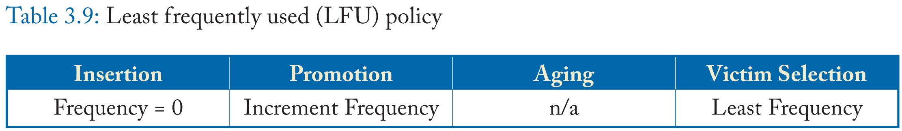

# Cache Replacement Policies 笔记

- [1 Introduction](#1)
- [2 A Taxonomy of Cache Replacement Policies](#2)
- [3 Coarse-Grained Replacement Policies](#3)
- [4 Fine-Grained Replacement Policies](#4)
- [5 Richer Considerations](#5)
- [6 Conclusions](#6)
&nbsp;   

## 1 Introduction

&nbsp;   

## 2 A Taxonomy of Cache Replacement Policies

### 2.1 Coarse-Grained Policies

### 2.2 Fine-Grained Policies

### 2.3 Design Considerations

&nbsp;   

## 3 Coarse-Grained Replacement Policies

### 3.1 Recency-Based Policies

### 3.2 Frequency-Based Policies

### 3.3 Hybrid Policies

&nbsp;   

## 4 Fine-Grained Replacement Policies

### 4.1 Reuse Distance Prediction Policies

### 4.2 Classification-Based Policies

### 4.3 Other Prediction Metrics

&nbsp;   

## 5 Richer Considerations

### 5.1 Cost-Aware Cache Replacement

### 5.2 Criticality-Driven Cache Optimizations

### 5.3 Multi-Core-Aware Cache Management

### 5.4 Prefetch-Aware Cache Replacement

### 5.5 Cache Architecture-Aware Cache Replacement

### 5.6 New Technology Considerations

&nbsp;   

## 6 Conclusions

