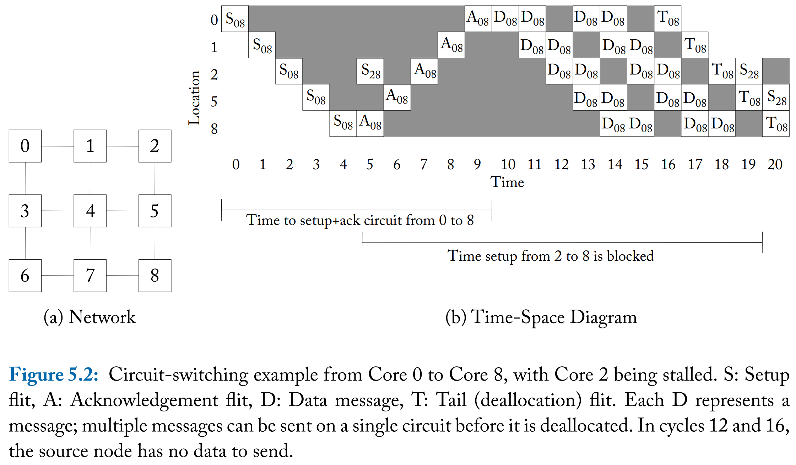
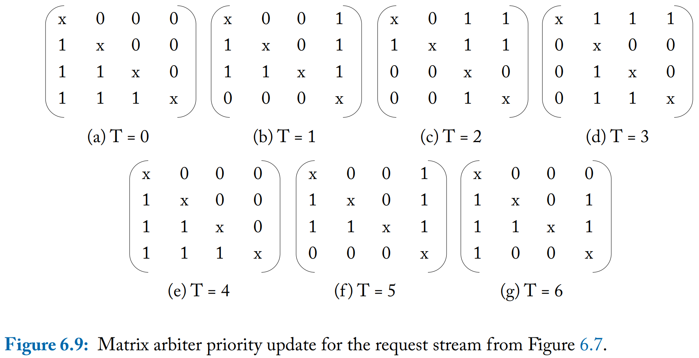

# On-Chip Networks 2nd 笔记

- [1 Introduction](#1)
- [2 Interface with System Architecture](#2)
- [3 Topology](#3)
- [4 Routing](#4)
- [5 Flow Control](#5)
- [6 Router Microarchitecture](#6)
- [7 Modeling and Evaluation](#7)
- [8 Case Studies](#8)
- [9 Conclusions](#9)

&nbsp;  

## 1 Introduction

&nbsp;  

## 2 Interface with System Architecture

&nbsp;  

## 3 Topology

&nbsp;  

## 4 Routing

&nbsp;  

## 5 Flow Control

&nbsp;  

## 6 Router Microarchitecture

&nbsp;  

## 7 Modeling and Evaluation

&nbsp;  

## 8 Case Studies

&nbsp;  

## 9 Conclusions

