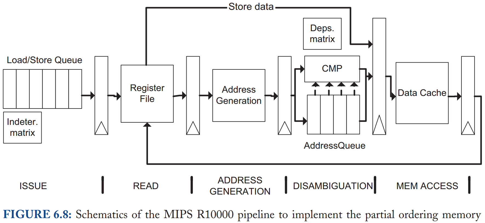
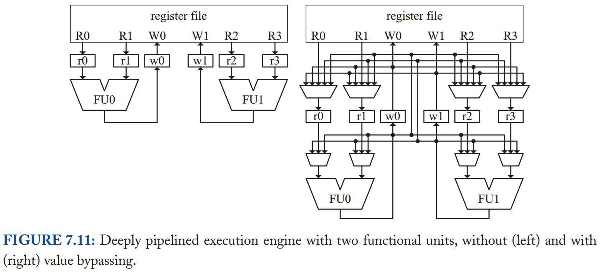

# Processor Microarchitecture an Implementation Perspective 读书笔记

> 因为没学过电路和硬件，很多方案在初看时无法进行深入的思考（主要是不清楚下层提供什么支持，上层需求是什么，有什么限制，各种设计有什么区别），只能拾人牙慧。 ~ 2020.05   

- [1 Introduction](#1)
- [2 Caches](#2)
- [3 The Instruction Fetch Unit](#3)
- [4 Decode](#4)
- [5 Allocation](#5)
- [6 The Issue Stage](#6)
- [7 Execute](#7)
- [8 The Commit Stage](#8)

&nbsp;   

## 1 Introduction

&nbsp;   

## 2 Caches

### 2.1 Address Translation

- physical: processor & bus
- virtual: app
  - **virtual aliasing: 多个 virtual page 映射到同一个 physical page**
- page table
- TLB
- **memory access 使用 physical addr**
  - VIVT
      - ambiguation: flush on context switch
      - aliasing
  - PIPT
      - 串行，先 MMU 再 Cache
      - 主要用于 outer cache
  - VIPT
      - 并行 MMU 和 Cache
      - aliasing：因为 virtual addr 和 physical addr 的 page offset 一样，因此如果 index 属于 page offset 的一部分，那么 physical tag 就可以保证没有 aliasing
      - 主要用于 L1 (i)cache

### 2.2 Cache Structure Organization

- cache 分为2部分
  - tag array
  - data array
- 物理地址由 **tag** + **index** + **offset** 组成
  - **这里的 offset 不是 page offset 而是 cacheline offset**，是用来定位在 cacheline 中的位置
  - 通常 index + offset 的长度 <= page offset 长度，避免 VIPT 中的 aliasing（index + offset 其实就是 一路 cache 大小）
      - 反例：若 index 与部分 page number 重叠，为避免 aliasing，保留的 tag' 延长为 page number（或 page coloring: OS 保证 VA 中 index 超出 page offset 部分与 page number 一致）
  - 通常 offset 长度就是 cacheline 大小
- index 部分作为 hashed key
- tag 存储在 tag array 中用于确认地址
  - 本质上就是找到 hash bucket 之后还要比较原始 key
  - 因为 set associativity 所以多路比较 tag

### 2.3 Lockup-Free Caches

当出现 memory request miss 时，允许 issue new memory request。把 miss 信息存储在 **MSHRs**（*miss status handling registers*）。MSHRs 相当于一个固定大小的池，负责记录和合并 missed L1Dcache request。

miss 分为 3 种

- primary miss：首次 miss，向 higher level fetch
- secondary miss：已经 miss 过了，默认合并（抛弃）
- structural-stall miss：没有资源处理，因 sturctural hazard 导致 stall
  - 例如 Fig2.5，N 就是 cacheline 长度，MSHRs 共有 N entries，位置蕴含 cacheline offset。于是不同 cacheline 同一位置的 miss 就会产生 sturctural hazard

- dest reg：涉及 load/store
- format：memory request 的元数据
- offset：cacheline offset
  - Fig2.6 引入 offset 是因为 Fig2.5 hash 导致的 sturctural hazard

还有另一种方案是 In-Cache MSHRs：将 MSHRs 做到 cache 内部，tag array 额外记录 cacheline 是否被 fetched 的标记。相当于把 cache miss 问题从计算层下放到存储层。好处是可以有相当多的 in-flight request。

### 2.4 Multiported Caches

- dual-ported cache：2 address decoders, 2 way multiplxers, 2 tag comparators, 2 aligners
  - 提高 bandwidth
  - 增加 access time
- 2 single-ported cache：data array 副本，tag array 副本或 dual-ported
  - 充分利用 bandwidth
  - 增加 area
  - 需要 data array synchronization: store, cache replacement, cacheline invalidation
- Virtual Multiporting：分时复用（time-division mutilpexing） single-ported cache
- Multibanking：cache 分割成若干 single-ported banks
  - 1 个 cycle 可以向不同 banks 同时 issue request
  - 仍然需要 2 address decoders, 2 way multiplxers, 2 tag comparators, 2 aligners，与 dual-ported 相比，tag array 和 data array 不需要 multiports

### 2.5 Instruction Caches

- single-ported 而非 dual-ported：指令通常是连续执行，通常一次取出整个 cacheline
- blocking 而非 lockup-free：指令整体上是按顺序执行，如果一条指令 miss，没有取其他指令的必要
- parallel tag/data array access 而非 serial access：
  - VIPT？tag 哪里来？
- icache 偏向于 sequential access；dcache 偏向于 random access

### Reference

- [memory faq](https://landley.net/writing/memory-faq.txt)
- [How Memory Is Accessed - Intel](https://software.intel.com/content/www/us/en/develop/articles/how-memory-is-accessed.html)
- [Memory part 2: CPU caches - LWN](https://lwn.net/Articles/252125/)
- [Cache组织方式 - 知乎](https://zhuanlan.zhihu.com/p/107096130)
- [计算机科学基础知识（一）:The Memory Hierarchy](http://www.wowotech.net/basic_subject/memory-hierarchy.html)
- [How does the VIPT to PIPT conversion work on L1->L2 eviction](https://stackoverflow.com/questions/55387857/how-does-the-vipt-to-pipt-conversion-work-on-l1-l2-eviction)
- [Why is the I-cache designed as VIPT, while the D-cache as PIPT?](https://community.arm.com/developer/ip-products/processors/f/cortex-a-forum/3608/why-is-the-i-cache-designed-as-vipt-while-the-d-cache-as-pipt)
- [Virtually indexed physically tagged cache Synonym](https://stackoverflow.com/questions/46588219/virtually-indexed-physically-tagged-cache-synonym)
- [Page Colouring on ARMv6 (and a bit on ARMv7)](https://community.arm.com/developer/ip-products/processors/b/processors-ip-blog/posts/page-colouring-on-armv6-and-a-bit-on-armv7)

&nbsp;   

## 3 The Instruction Fetch Unit

为了让流水线打满每一个 cycle，需要在 IF 时就计算 next fetch address。难度在于分支指令（conditional branch, jump, subroutine call, subroutine return）

面临3个问题：

- 是否是 Branch Instruction
- Taken / Not Taken
- Target Address / Next Address

### 3.1 Instruction Cache

- 传统 Cache：存储 instruction in static order（二进制顺序）
- **Trace Cache**：存储 instruction in **dynamic order**
  - replication, bandwidth

### 3.2 Branch Target Buffer

- BTB: linear address -> target linear(virtual?) address

### 3.3 Return Address Stack

### 3.4 Conditional Branch Prediction

#### 3.4.1 Static Prediction

- compiler knowledge
- ISA 提供一些暗示指令
- 利用一些规律，比如 loop 向上跳转

#### 3.4.2 Dynamic Prediction

- saturating counter：若历史是连贯有规律，效果很好
  - 资源有限：伪共享
      - PC: address hash
      - branch global history: pattern history table
      - 一种有效手段是：branch global history XOR PC

- hybrid: selector
  - warm-up，对冲
  - selector 可能也是 saturating counter

### Reference

- [The microarchitecture of Intel, AMD and VIA CPUs](https://www.agner.org/optimize/microarchitecture.pdf)
- [Microbenchmarking Return Address Branch Prediction](http://blog.stuffedcow.net/2018/04/ras-microbenchmarks/)
- [Branch Prediction Review](https://courses.cs.washington.edu/courses/csep548/06au/lectures/branchPred.pdf)
- 《Modern Processor Design - Fundamentals of Superscalar Processors》

&nbsp;   

## 4 Decode

### 4.1 RISC Decoding

- fixed instruction length
- simple format

### 4.2 The x86 ISA

- variable length
  - 由 opcode 和 ModR/M 决定
  - opcode 决定是否存在 ModR/M
  - ModR/M 决定是否存在 SIB
  - prefix 长度 0-4
- complex format
  - operand 位置可变
  - 反正各种乱

### 4.3 Dynamic Translation

- CISC -> RISC-like micro-ops

### 4.4 High-Performance x86 Decoding

- Instruction Length Decoder: raw byte stream -> insturctions
- Dynamic Translation Unit: instructions -> micro-ops

### Reference

- [The microarchitecture of Intel, AMD and VIA CPUs](https://www.agner.org/optimize/microarchitecture.pdf)

&nbsp;   

## 5 Allocation

- register renaming：消除 false dependences
  - 思路上类似 Multi-Versioning
- instruction dispatch：分配资源
  - issue queue entry（或 RS）
  - ROB entry
  - load/store buffer entry

- dependences
  - data: read from
  - name: write after ...

### 5.1 Renaming through The Reorder Buffer

- ROB 存 in-flight register value
- architectural register file 存 latest committed register value
- register map table 存 register 的最新定义位置

### 5.2 Renaming through A Rename Buffer

- ROB 浪费 value filed

### 5.3 Merged Register File

- register map table 存 register 最新定义位置
- freelist
  - 如何确定回收，如果不跟踪额外信息

- 如果之后的使用同一 architectural register 的指令 commit，那么之前的 physical register 可以回收
  - 考虑到 branch misprediction，下面条件是不足的
      - 之后使用同一 architectural register 的指令被 fetched
      - 之前访问 physical register 的指令 commit
  - 如图，指令(2)提交后，p1 可以被回收
  - 不跟踪读操作，因为时间戳是增长的，new write commit 保证 previous register 可以回收
  - 那也就是说 ROB entry 需要存 logical register 对应的 previous physical register-ID？

### 5.4 Register File Read

- read before execution（preferred）
  - 需要存储空间
  - execution 时要再读一遍
  - 有些 non-available，之后 bypass network
- read on execution
  - 需要大量 port
  - 只读一遍

### 5.5 Recovery in Case of Misspeculation

- 释放资源
- register map table 需要 undo

### 5.6 Comparison of The Three Schemes

> 没搞懂 register value 到底在哪存？？？   
> 本质上来说也很简单：新版本提交后旧版本就可以被回收了。   
> 位置不同会影响 read/write interconnect 逻辑。   
>    
> **我倾向于这2种：**   
> **1. architectural register file + reorder buffer（存数据）**   
> **2. merged register file + reorder buffer（存索引）**   

- 如果把 physical register 放到 ROB，就只需 FIFO 而不用维护 freelist
  - register map table 从 logical register 映射到 ROB entry
  - 为什么说 “ROB entry 需要记录 logical register 对应的 previous physical register-ID”？难道不是“去 register map table 查一下，对应的最新如果是自己，那就 update architectural state，否则直接结束”？

### Reference

- 《Modern Processor Design - Fundamentals of Superscalar Processors》
- [The Architecture of the Nehalem Processor and Nehalem-EP SMP Platforms](http://citeseerx.ist.psu.edu/viewdoc/download?doi=10.1.1.455.4198&rep=rep1&type=pdf)

&nbsp;   

## 6 The Issue Stage

> 整个设计会随着 Register Filer, RS, ROB 的设计有些变化。要考虑到：   
> 1. 数据被依赖时未完成计算   
> 2. 数据计算完成时要 wakeup signal + bypass 传播   
> 3. commit 时考虑哪些 entry 被释放，数据转移到哪里   

### 6.1 Introduction

- in-order / out-of-order
- reservation station / distributed issue queue / unified issue queue
- 注意 issue logic of memory operations

### 6.2 In-Order Issue Logic

- scoreboard
  - data dependence table：追踪 register 是否可用
  - resource table：追踪 EU 是否可用
- VLIW

### 6.3 Out-Order Issue Logic

- read source operand before/on execution
- 下面讨论统一假设 merged register file
- memory dependences 直到 address 计算完才确定

#### 6.3.1 Issue Process when Source Operands Are Read before Issue

- Ctrl info：存储 execution meta
  - 哪些 ALU
  - 内存操作宽度
  - 立即数使用
- Src1/2Id：source operand id（register-id）
- V1/2：source operand 是否 valid
- Src1 data / Src2 data Or Imm：存放 input value
- R1/2：表示数据是否 ready

##### 6.3.1.1 Issue Queue Allocation

- 分配 entry
- 获取 renaming info 和 register value

##### 6.3.1.2 Instruction Wakeup

- 通知 source operands 计算完成
- 传播（register-ID, value），在 issue queue 中检索并更新
- 若 renaming table 中出现 register-id，标记为 available（之后 read before issue）
- 因为 stage 并发，要保证没有 wakeup 遗漏
  - 先获取 register-ID，再检查 available-bit（可以考虑单独一个表）
  - 这些问题很简单，因为事件发生是以 cycle 为离散单位的，cycle 之间天然形成 *happens-before*

- 提前 wakeup signal，减少 bubble
- 通过 bypass 从 FU 传播到 FU
- 把 wakeup 和 select 压缩到 1 个 cycle，以支持高性能 back-to-back execution

有2种方案生成 wakeup signal：

- 把生成 signal 做进 pipeline stage（固定位置，位于 execution 几个 cycle 之前）
- 倒计时（shift register）

这2种方案要求 instruction latency 是已知的，只对计算操作有效，而对内存访问操作无效。对 load 操作有2种策略：

- conservative：延迟 signal，直到确认 load hit
- speculative：平衡 load miss 的 penalty
  - load 操作占程序 20%，延迟 signal 极大影响性能

##### 6.3.1.3 Instruction Selection

- 选择 ready 的指令
  - source operands
  - execution resources
- 将 select 逻辑分散到 arbiters/schedulers，而不是做成一个单一 select 单元
  - 原因是：**The timing of the selection logic is very critical since it has to be done after the wakeup logic to support back-to-back execution of single-cycle latency operations.**

##### 6.3.1.4 Entry Reclamation

- issue 之后 entry 可以被回收
- speculative wakeup 需要 delay 回收

#### 6.3.2 Issue Process when Source Operands Are Read after Issue

##### 6.3.2.1 Read Port Reduction

#### 6.3.3 Other Implementations for Out-of-Order Issue

#### 6.3.3.1 Distributed Issue Queue

- 指令分类，细化调度（比如内存操作和非内存操作）

#### 6.3.3.2 Reservation Stations

- 相当于把 issue queue 下放到各个 FU

### 6.4 Issue Logic for Memory Operations

- memory disambiguation policy
  - non-speculative：需要确保和之前没有依赖才能执行
  - speculaive：预测是否有依赖

#### 6.4.1 Non-Speculative Memory Disambiguation

##### 6.4.1.1 Case Study 1: Load Ordering and Store Ordering on an AMD K6 Processor

- store
  - store queue 顺序发射
  - address generation，读 value
  - (address, value) 存入 store buffer
  - store buffer 顺序提交到 L1D
- load
  - load queue 顺序发射
  - address generation
  - 在 store buffer 中检查是否与 older store 产生 address 冲突
      - 包括 address generation stage
      - scheduler 保证 older store address 都被检查了（这保证了 **single processor program order**）

#### 6.4.1.2 Case Study 2: Partial Ordering on a MIPS R10000 Processor

store 顺序；load 可以乱序只要之前的 address 已经被计算完成

- load/store queue 顺序发射
- indetermination matrix：标记 address 是否被计算完成
- dependency matrix：标记 load 依赖 store address
- address queue：记录 address，load 需要比较并标记依赖

- store 顺序发射，重置 dependency matrix column
- load 等待 dependency matrix row 重置

#### 6.4.2 Speculative Memory Disambiguation

- load 不需要等待之前的 store 完成地址计算
- speculative issue load，需要处理 misprediction 和 recover

##### 6.4.2.1 Case Study: Alpha 21264

- load-load memory violation trap：通过检测 younger 但已经 issued 的 load
- store-load memory violation trap：通过检测 younger 但已经 issued 的 load
- retire in program order：因此虽然 store 可以 out-of-order issue，但不需要检测 store-store memory violation trap

### 6.5 Speculative Wakeup of Load Consumers

- 平衡 bubble 与 penalty
  - back-to-back execution
  - missepculation
- 激进的策略可能导致 architectural hazard（比如 deadlock）
  - 跟踪更多信息

### Reference

- 《Modern Processor Design - Fundamentals of Superscalar Processors》

&nbsp;   

## 7 Execute

- FPU / ALU / AGU / BRU
- data cache
- bypassing network

### 7.1 Functional Units

#### 7.1.1 Integer Arithmetic and Logical Unit

#### 7.1.2 Integer Multiplication and Division

- IMUL, IDIV：因为 area 和 power，通常做进 FPU，integer->float->integer（那宽度怎么办？IEEE754？）

#### 7.1.3 Address Generation Unit

- **flat** memory model: linear address space
- **segmented** memory model
  - logical address: (segment ID, offset)
  - linear address = segment base + offset

- 1st cycle
  - 计算 **offset = base + (index * scale) + displacement**
  - 读 segment base 和 limit，从 segment register file
- 2nd cycle
  - 计算 **linear address** = segment base + offset
  - 检查 offset 是否满足 limit
  - 检查 segment 访问许可

#### 7.1.4 Branch Unit

- 执行 control-flow instruction (branch, jump, call, return)
- 生成 next instruction address

- direct absolute：指令给出 next PC
- direct PC-relative：指令给出 next PC offset
- indirect：指令给出 register 表示 next PC

#### 7.1.5 Float-Point Unit

- float-point arithmetic
- conversion

#### 7.1.6 SIMD Unit

### 7.2 Result Bypassing

> 假设 merged register file   

- speculatively read from noncommitted state
- compiler & Out-of-Order engine fill bubbles

- 省去中间步骤，直接从 producer bypass 到 consumer
  - bypass network 是 execution engine 中的重要设计，影响 area, power, critical path, physical layout

#### 7.2.1 Bypass in a Small Out-of-Order Machine

- multiplexor
  - from register file
  - from FU
  - from other FU
- result bus

#### 7.2.2 Multilevel Bypass for Wide Out-of-Order Machines

- Fig7.13 显示 I1 数据流在多个 stages 间 bypass，与 Fig7.11 Fig7.12 相匹配

#### 7.2.3 Bypass for In-Order Machines

- staging：延迟 write-back，为了保证 state in-order
  - staging latch：将 in-flight result 拿住
  - 为了减少 bubble：所有 staging 处进行 bypass

- merged register file 为每个 staging 准备空间

#### 7.2.4 Organization of Functional Units

- ALU / AGU 设计 bypass network：整数运算和地址有数据依赖
- Float-Point / SIMD Unit 设计 bypass network
- memory load 到 ALU / AGU 以及 Float-Point / SIMD 设计 bypass network：数据运算对数据加载有依赖

### 7.3 Clustering

解决复杂度的方法：**对关键部分进行 partition**（如果workload允许拆分）

#### 7.3.1 Clustering the Bypass Network

- FU 只允许 bypass 到自己

#### 7.3.2 Clutering with Replicated Register Files

> **计算结点扩展，存储结点备份**   

- 4 个 FU 分开到 2 个 cluster，每个 cluster 拥有 register file 备份
  - 减少了 port
- unified issue queue
  - inter-cluster communication（怎么协调数据依赖产生的交互呢）

#### 7.3.3 Clustering with Distributed Queue and Register Files

> **计算存储分离，share everything**，但是存储非一致性访问   

- 4 个 FU 分开到 2 个 cluster，每个 cluster 独占一部分 register file
- result 不 broadcast，但允许 communicate
- rename stage 将 issue queue 分开：**instruction steering mechanism**
  - 减少依赖，减少 inter-cluster communication
  - 平衡 workload

&nbsp;   

## 8 The Commit Stage

- **architectural state**: in-order commit
- **speculative state**: in-flight 状态
- x86 micro-op：全部完成才 commit
  - 例外：fast string operation 填满 retirement window
- 回收资源

### 8.2 Architectural State Management

- store 一直在 store buffer 直到 commit
- load 需要检查 store buffer
- load 在 commit 时是否需要一直持有 cacheline 来保证 store-load order？

### 8.2.1 Architectural State Based on a Retire Register File

- ROB：环形队列
  - ROB entry: (instruction info, produced value)
- ROB entry commit
  - 更新 register map table（如果仍 renamed 到这个 entry，否则 discard）
  - 数据写回 retirement register file（如果仍 renamed 到这个 entry，否则 discard）
  - **bypass**
      - read before issue：？data read 读不到会产生 bubble？？
      - read after issue：需要 invalidate 所有 stage 中 ROB entry 的引用

### 8.2.2 Architectural State Based on a Merged Register File

- 省空间，不需要移动数据和 bypass 通知
- 需要确定何时才能回收某个 register
  - 如果之后的使用同一 architectural register 的指令 commit，那么之前的 physical register 可以回收

### 8.3 Recovery of the Speculative State

### 8.3.1 Recovery form a Branch Misprediction

- front-end recovery
  - flush rename 之前的 wrong path
  - 恢复 branch predictor
  - 修正 PC
- back-end recovery：从 microarchitecture 中移除 bogus-instruction
  - issue queue / reorder buffer / memory order buffer
  - register map table

- ROB + Retirement Register File
  - 等待 wrong path 之前 commit
  - 恢复 register map table
- Merged Refister File
  - 不需要等待 wrong path 之前 commit，需要维护 register map table
      - undo/redo log：根据 checkpoint 在 mispredicted 前后区分
      - checkpoint：对 register map table 进行快照

### 8.3.2 Recovery from an Exception

- exception 需要等到 commit stage 处理
  - 确定不是 speculative
  - 需要保留顺序执行到这条指令前的 architectural state
- 清空所有 in-flight
  - speculative 按照 misprediction 恢复
- front-end 重定向到 exception handler
