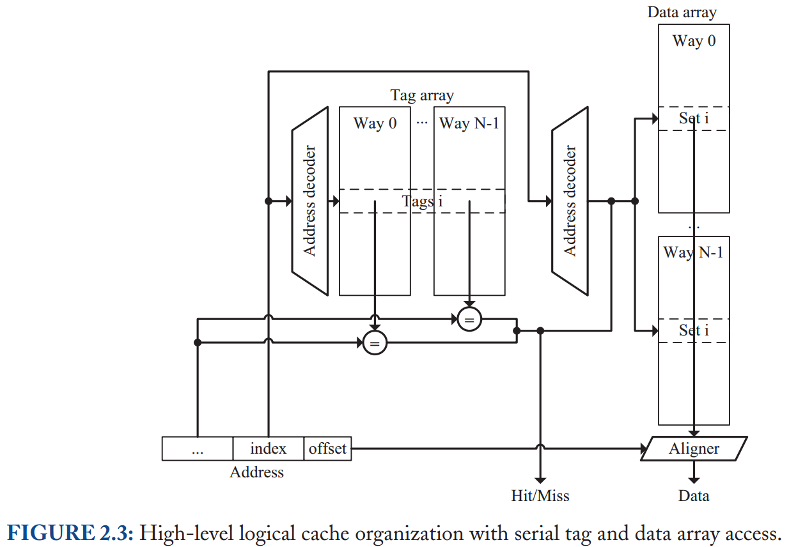
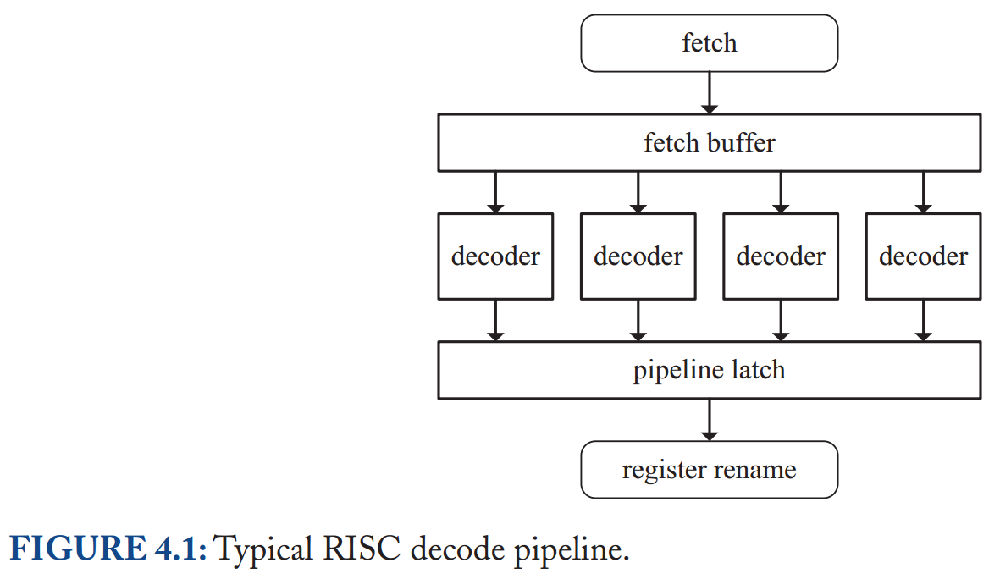

## Processor Microarchitecture an Implementation Perspective 读书笔记

- [1 Introduction](#1)
- [2 Caches](#2)
- [3 The Instruction Fetch Unit](#3)
- [4 Decode](#4)
- [5 Allocation](#5)
- [6 The Issue Stage](#6)
- [7 Execute](#7)
- [8 The Commit Stage](#8)

&nbsp;   

## 1 Introduction

&nbsp;   

## 2 Caches

### Address Translation

- physical: processor & bus
- virtual: app
  - **virtual aliasing: 多个 virtual page 映射到同一个 physical page**
- page table
- TLB
- **memory access 使用 physical addr**
  - VIVT
      - ambiguation: flush on context switch
      - aliasing
  - PIPT
      - 串行，先 MMU 再 Cache
      - 主要用于 outer cache
  - VIPT
      - 并行 MMU 和 Cache
      - aliasing：因为 virtual addr 和 physical addr 的 page offset 一样，因此如果 index 属于 page offset 的一部分，那么 physical tag 就可以保证没有 aliasing
      - 主要用于 L1 (i)cache

### Cache Structure Organization

- cache 分为2部分
  - tag array
  - data array
- 物理地址由 **tag** + **index** + **offset** 组成
  - **这里的 offset 不是 page offset 而是 cacheline offset**，是用来定位在 cacheline 中的位置
  - 通常 index + offset 的长度 <= page offset 长度，避免 VIPT 中的 aliasing（index + offset 其实就是 一路 cache 大小）
      - 反例：若 index 与部分 page number 重叠，为避免 aliasing，保留的 tag' 延长为 page number（或 page coloring: OS 保证 VA 中 index 超出 page offset 部分与 page number 一致）
  - 通常 offset 长度就是 cacheline 大小
- index 部分作为 hashed key
- tag 存储在 tag array 中用于确认地址
  - 本质上就是找到 hash bucket 之后还要比较原始 key
  - 因为 set associativity 所以多路比较 tag

### Lockup-Free Caches

当出现 memory request miss 时，允许 issue new memory request。把 miss 信息存储在 **MSHRs**（*miss status handling registers*）。MSHRs 相当于一个固定大小的池，负责记录和合并 missed L1Dcache request。

miss 分为 3 种

- primary miss：首次 miss，向 higher level fetch
- secondary miss：已经 miss 过了，默认合并（抛弃）
- structural-stall miss：没有资源处理，因 sturctural hazard 导致 stall
  - 例如 Fig2.5，N 就是 cacheline 长度，MSHRs 共有 N entries，位置蕴含 cacheline offset。于是不同 cacheline 同一位置的 miss 就会产生 sturctural hazard

- dest reg：涉及 load/store
- format：memory request 的元数据
- offset：cacheline offset
  - Fig2.6 引入 offset 是因为 Fig2.5 hash 导致的 sturctural hazard

还有另一种方案是 In-Cache MSHRs：将 MSHRs 做到 cache 内部，tag array 额外记录 cacheline 是否被 fetched 的标记。相当于把 cache miss 问题从计算层下放到存储层。好处是可以有相当多的 in-flight request。

### Multiported Caches

- dual-ported cache：2 address decoders, 2 way multiplxers, 2 tag comparators, 2 aligners
  - 提高 bandwidth
  - 增加 access time
- 2 single-ported cache：data array 副本，tag array 副本或 dual-ported
  - 充分利用 bandwidth
  - 增加 area
  - 需要 data array synchronization: store, cache replacement, cacheline invalidation
- Virtual Multiporting：分时复用（time-division mutilpexing） single-ported cache
- Multibanking：cache 分割成若干 single-ported banks
  - 1 个 cycle 可以向不同 banks 同时 issue request
  - 仍然需要 2 address decoders, 2 way multiplxers, 2 tag comparators, 2 aligners，与 dual-ported 相比，tag array 和 data array 不需要 multiports

### Instruction Caches

- single-ported 而非 dual-ported：指令通常是连续执行，通常一次取出整个 cacheline
- blocking 而非 lockup-free：指令整体上是按顺序执行，如果一条指令 miss，没有取其他指令的必要
- parallel tag/data array access 而非 serial access：
  - VIPT？tag 哪里来？
- icache 偏向于 sequential access；dcache 偏向于 random access

### Reference

- [memory faq](https://landley.net/writing/memory-faq.txt)
- [How Memory Is Accessed - Intel](https://software.intel.com/content/www/us/en/develop/articles/how-memory-is-accessed.html)
- [Memory part 2: CPU caches - LWN](https://lwn.net/Articles/252125/)
- [Cache组织方式 - 知乎](https://zhuanlan.zhihu.com/p/107096130)
- [计算机科学基础知识（一）:The Memory Hierarchy](http://www.wowotech.net/basic_subject/memory-hierarchy.html)
- [How does the VIPT to PIPT conversion work on L1->L2 eviction](https://stackoverflow.com/questions/55387857/how-does-the-vipt-to-pipt-conversion-work-on-l1-l2-eviction)
- [Why is the I-cache designed as VIPT, while the D-cache as PIPT?](https://community.arm.com/developer/ip-products/processors/f/cortex-a-forum/3608/why-is-the-i-cache-designed-as-vipt-while-the-d-cache-as-pipt)
- [Virtually indexed physically tagged cache Synonym](https://stackoverflow.com/questions/46588219/virtually-indexed-physically-tagged-cache-synonym)
- [Page Colouring on ARMv6 (and a bit on ARMv7)](https://community.arm.com/developer/ip-products/processors/b/processors-ip-blog/posts/page-colouring-on-armv6-and-a-bit-on-armv7)

&nbsp;   

## 3 The Instruction Fetch Unit

为了让流水线打满每一个 cycle，需要在 IF 时就计算 next fetch address。难度在于分支指令（conditional branch, jump, subroutine call, subroutine return）

面临3个问题：

- 是否是 Branch Instruction
- Taken / Not Taken
- Target Address / Next Address

### Instruction Cache

- 传统 Cache：存储 instruction in static order（二进制顺序）
- **Trace Cache**：存储 instruction in **dynamic order**
  - replication, bandwidth

### Branch Target Buffer

- BTB: linear address -> target linear(virtual?) address

### Return Address Stack

### Conditional Branch Prediction

#### Static Prediction

- compiler knowledge
- ISA 提供一些暗示指令
- 利用一些规律，比如 loop 向上跳转

#### Dynamic Prediction

- saturating counter：若历史是连贯有规律，效果很好
  - 资源有限：伪共享
      - PC: address hash
      - branch global history: pattern history table
      - 一种有效手段是：branch global history XOR PC

- hybrid: selector
  - warm-up，对冲
  - selector 可能也是 saturating counter

### Reference

- [The microarchitecture of Intel, AMD and VIA CPUs](https://www.agner.org/optimize/microarchitecture.pdf)
- [Microbenchmarking Return Address Branch Prediction](http://blog.stuffedcow.net/2018/04/ras-microbenchmarks/)
- [Branch Prediction Review](https://courses.cs.washington.edu/courses/csep548/06au/lectures/branchPred.pdf)
- 《Modern Processor Design - Fundamentals of Superscalar Processors》

&nbsp;   

## 4 Decode

### RISC Decoding

- fixed instruction length
- simple format

### The x86 ISA

- variable length
  - 由 opcode 和 ModR/M 决定
  - opcode 决定是否存在 ModR/M
  - ModR/M 决定是否存在 SIB
  - prefix 长度 0-4
- complex format
  - operand 位置可变
  - 反正各种乱

### Dynamic Translation

- CISC -> RISC-like micro-ops

### High-Performance x86 Decoding

- Instruction Length Decoder: raw byte stream -> insturctions
- Dynamic Translation Unit: instructions -> micro-ops

### Reference

- [The microarchitecture of Intel, AMD and VIA CPUs](https://www.agner.org/optimize/microarchitecture.pdf)

&nbsp;   

## 5 Allocation

&nbsp;   

## 6 The Issue Stage

&nbsp;   

## 7 Execute

&nbsp;   

## 8 The Commit Stage

